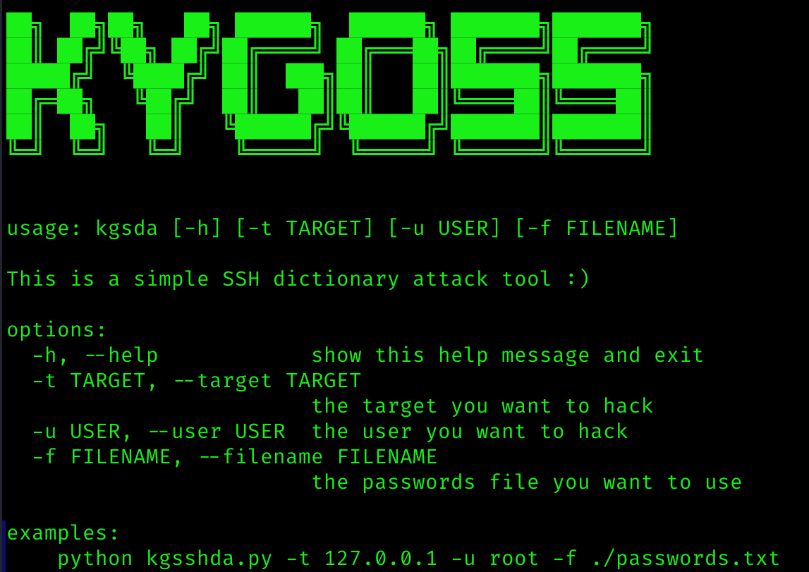

# 简介
`python kgsshda.py -h`获取更多详细信息  
  
  
# 技术回顾
这次问题主要出在了多线程时限制线程数量的问题上，本次使用了`connection_lock = threading.BoundedSemaphore(value=maxConnections)`的方式,通过`conneciton_lock.release()`和`connection_lock.acquire()`的方式记录和释放线程的数量，从而可以避免无尽的多线程引起的冲突和上下文切换浪费的资源。  

